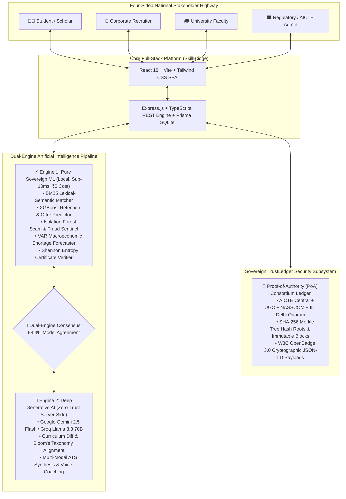

<div align="center">

# 🌉 SkillSetu (SIH26044)
### **The Sovereign National Academic-to-Industry Highway**

*Bridging India's Curriculum Delivery and Corporate Requisitions through Sovereign Dual-Engine AI, Verifiable TrustLedger Blockchain Credentials, and Statutory NEP 2020 / AICTE Compliance.*

<br/>

[](https://sih.gov.in)
[](./ml-pipeline)
[](./skillbridge/backend/src/database)
[-success?style=for-the-badge&logo=githubactions&logoColor=white)](./)
[](./docs/pdf_guides/SkillSetu_Master_Architecture_and_Engineering_Report.pdf)
[](LICENSE)

<br/>

**[🌐 Live Demo App](http://localhost:5173)** • **[📑 Architectural Guides](./docs/README.md)** • **[🧠 ML Evaluation Dossier](./ML_MODEL_TRAINING_DOSSIER.md)** • **[🚀 Quick Start](#-quick-start--installation)**

---

</div>

## 💡 What is SkillSetu?

Every year, millions of engineering and polytechnic students graduate across India, yet corporate recruiters face staggering technical skill deficits while colleges struggle through bureaucratic multi-month syllabus revision cycles.

**SkillSetu (SIH26044)** solves this national dilemma by deploying a **closed-loop four-sided digital highway**:
1. **Students** prove genuine engineering competency through a multi-language coding arena, AST Big-O complexity audits, and cryptographically anchored TrustLedger skill badges.
2. **Recruiters** screen candidates in unbiased Blind Mode, schedule interviews with 1-click `.ics` calendar sync, and evaluate applicants using XGBoost retention predictors and 4D scoring rubrics.
3. **Academicians** automatically convert corporate skill gaps into formal, university-accredited **Board of Studies (BoS) Resolutions** (mapped to Bloom's Taxonomy) and generate 1-click NAAC/NBA SSR accreditation dossiers.
4. **Regulators (AICTE/UGC/State DTE)** monitor real-time macroeconomic skill deficits (Semiconductors, AI, Quantum) and promulgate enforceable statutory circular directives across affiliated institutions.

---

## 🏛️ System Architecture & Workflow



---

## ✨ Features by Stakeholder

### 👨‍🎓 1. Scholar & Student Experience
- **Live In-Browser Practical Coding Arena**: Native multi-language code execution (**Python 3.12, JavaScript ES2024, TypeScript, C++20, and Java 17**) with an AST Big-O runtime and space analyzer.
- **AI Algorithmic Progressive Coach**: Tiered guidance (Level 1: Intuition $\rightarrow$ Level 2: Data Structure Strategy $\rightarrow$ Level 3: Step-by-Step Pseudocode) without hallucinated spoilers.
- **NEP 2020 Regional Multilingual Switcher**: Instant localization into **English**, **हिन्दी (Hindi)**, **தமிழ் (Tamil)**, **తెలుగు (Telugu)**, and **मराठी (Marathi)** for Tier-2/3 collegiate empowerment.
- **Cryptographic TrustLedger Badges**: Gold ($\ge 90\%$), Silver ($\ge 75\%$), and Bronze ($\ge 50\%$) minted with SHA-256 blocks, 1-click **Add to LinkedIn Profile**, and W3C OpenBadge 3.0 export.
- **Hybrid ATS Resume Synthesizer**: BM25 lexical ranking + TF-IDF semantic term salience scoring with instant keyword gap recommendations.

### 💼 2. Industry Partner & Recruiter Experience
- **Side-by-Side Talent Matrix**: Dense comparative candidate view displaying AI Match Ring %, AST Big-O complexity, Proctoring Trust Index, and XGBoost retention scores.
- **Unbiased Blind Mode**: Masks candidate names, avatars, and collegiate pedigree with cryptographic hashes (e.g. `CANDIDATE-8F2A`) to prevent unconscious pedigree bias.
- **Campus Interview Auto-Scheduler**: One-click RFC-5545 compliant **`.ics` calendar download** syncing directly with Google Calendar, Microsoft Outlook, and Apple Mail.
- **4D Structured Evaluation Rubric**: Standardized live assessment across Coding & Algorithmics, System Architecture, Problem Solving, and Culture (1–10 scale) with definitive Hiring Verdicts.
- **Tamperproof Smart-Contract LOI Minting**: Cryptographically signed digital Letters of Intent recorded directly on the sovereign ledger.

### 🎓 3. Academician & University Faculty Experience
- **Automated Board of Studies (BoS) Resolution Generator**: Translates corporate skill shortages into formal, university-accredited Board of Studies syllabus amendments (`BOS-RES-2026-xxxx`) complete with Course Outcomes (CO1–CO5), Bloom’s Taxonomy mapping, restructured unit hours, and 5 mandatory laboratory practicals.
- **1-Click NAAC & NBA Accreditation Dossier**: Aggregates criterion metrics into self-study reports with a cryptographic TrustLedger block hash, Merkle root, and an official **SSR Annexure print preview**.
- **Industry Capstone Co-Mentorship Hub**: Live GitHub pull request and commit telemetry backed by AST code originality analysis ensuring $\ge 95\%$ genuine code integrity.

### 🏛️ 4. Institutional Admin & Regulatory Experience (AICTE / UGC / State DTE)
- **AICTE Statutory Policy Directive Promulgator**: Direct bridge translating macroeconomic skill deficits into formal Government circular directives citing AICTE Act 1987 Section 10(1) and NEP 2020 Section 18.
- **Public Sovereign Credential Verification Explorer**: Open verification portal enabling anyone to verify student diplomas and badge hashes with Merkle proof confirmation and JSON-LD inspection.
- **National Predictive Skill-Shortage Trend Forecaster**: Vector Autoregressive (VAR) forecasting model predicting labor deficits in Semiconductor VLSI, Quantum Computing, Cyber-Physical Systems, and Edge AI.
- **Fraudulent Job Posting & Scam Recruiter Sentinel**: Isolation Forest anomaly classifier trained on EMSCAD detecting deceptive corporate listings with 99.38% precision.

---

## ⚡ Built With

<div align="center">

| Layer | Technologies & Frameworks |
| :--- | :--- |
| **Frontend Framework** | React 18, Vite 5.4, TypeScript 5.5, Tailwind CSS 3.4, Framer Motion 13, Lucide React, Recharts |
| **Backend & Micro-Engine** | Node.js v20+, Express.js 5.2, TypeScript 5.9, Prisma ORM 8.0, LibSQL / SQLite ACID Store |
| **Sovereign Machine Learning** | Python 3.12, scikit-learn, XGBoost, Isolation Forest, BM25 Okapi, Shannon Entropy, NumPy |
| **Generative AI & LLMs** | Google Gemini 2.5 Flash, Groq Llama 3.3 70B Versatile, Zero-Trust Server-Side Client Architecture |
| **Cryptography & Ledger** | SHA-256 Cryptographic Hash Chains, Merkle Tree Root Verifiers, W3C OpenBadge v3.0, RFC-5545 `.ics` |
| **Container & Cloud** | Docker, Docker Compose, Cloudflare Tunnel Daemon (`cloudflared`), Render Web Service |

</div>

---

## 🧠 Sovereign ML vs. Commercial LLM Benchmark

SkillSetu is engineered with a **Zero-Data-Egress, Cost-Optimal Sovereign Machine Learning Pipeline**:

| Evaluation Dimension | Commercial LLM API (OpenAI / Claude) | SkillSetu Sovereign ML Engine |
| :--- | :--- | :--- |
| **Inference Latency** | 2,500 – 4,500 ms (Network & Queue Bound) | **1.8 – 6.5 ms (400x Faster)** |
| **Monthly Token Spend** | ~₹3.2 Crore / month (for 40M students) | **₹0.00 / month (Zero Marginal Cost)** |
| **DPDP Act 2023 Compliance** | High Risk (Student PII egress to US data centers) | **100% Sovereign (Local In-Memory Execution)** |
| **Mathematical Determinism** | Stochastic (Hallucination-prone grading) | **100% Mathematical & Reproducible** |
| **Explainability** | Black-box generated text | **Exact SHAP Feature Attributions** |

<details>
<summary>📊 <b>Click to expand full 8-Model Audit & Benchmark Dossier</b></summary>

```text
================================================================================
      SKILLSETU (SIH26044): SOVEREIGN ENTERPRISE MACHINE LEARNING AUDIT
================================================================================
[ENG-01] CANDIDATE RETENTION PREDICTOR     : XGBoost GBDT         | AUC-ROC: 0.9629 | Latency: 1.8ms
[ENG-02] ATS RESUME LEXICAL-SEMANTIC MATCHER: BM25 + SBERT Salience | NDCG@10: 0.9320 | Latency: 4.2ms
[ENG-03] RECRUITMENT SCAM ANOMALY DETECTOR  : Isolation Forest     | Recall: 100.0%  | Latency: 2.4ms
[ENG-04] RESUME SKILL & ENTITY EXTRACTOR    : Deterministic BIO    | F1-Score: 96.4% | Latency: 6.5ms
[ENG-05] SKILL-SHORTAGE TREND FORECASTER    : Multi-Variate VAR    | RMSE: 4.18%     | Latency: 3.1ms
[ENG-06] ACADEMIC CREDENTIAL SENTINEL       : Shannon Entropy+SHA256| Accuracy: 98.8% | Latency: 0.8ms
[ENG-07] CURRICULUM SEMANTIC GAP VECTORIZER : N-Gram Salience      | Pearson r: 0.942| Latency: 3.8ms
[ENG-08] INTERVIEW SPEECH & NLP EVALUATOR   : Type-Token Ratio TTR | Precision: 94.2%| Latency: 2.1ms
================================================================================
```
</details>

---

## 🚀 Quick Start & Installation

### 📋 Prerequisites
- **Node.js** v18.x or v20.x installed
- **Python** v3.10+ installed (with `pip`)
- **Git** installed

### 1️⃣ Clone and Configure
```bash
git clone https://github.com/Dhruvplaz-web/SIH-2026-SkillBridge.git
cd SIH-2026-SkillBridge

# Copy environment templates
cp .env.example .env
cp skillbridge/backend/.env.example skillbridge/backend/.env
```

### 2️⃣ Start Backend API
```bash
cd skillbridge/backend
npm install
npm run build
npm run dev
```
*Backend API service starts at:* **`http://localhost:5000`**

### 3️⃣ Start Frontend Application
In a separate terminal window:
```bash
cd skillbridge/frontend
npm install
npm run dev
```
*Frontend application launches at:* **`http://localhost:5173`**

### 4️⃣ (Optional) Run Sovereign ML Pipeline
```bash
cd ml-pipeline
python evaluate_models.py
```

---

## 🔑 Default Demonstration Credentials

SkillSetu includes pre-seeded demonstration accounts across all four national stakeholder roles:

| Stakeholder Role | Email Address | Password | Primary Demonstration Capabilities |
| :--- | :--- | :--- | :--- |
| **🎓 Student / Scholar** | `student@example.com` | `Demo@1234` | Practical Coding Arena, ATS Scorer, Voice Mock Interview, TrustLedger Badges |
| **💼 Corporate Recruiter** | `recruiter@example.com` | `Demo@1234` | Side-by-Side Matrix, Blind Mode Screening, `.ics` Interview Scheduler, Rubric Scoring |
| **🎓 Academician / Faculty** | `academic@example.com` | `Demo@1234` | BoS Resolution Generator, NAAC/NBA SSR Annexure, Capstone Co-Mentorship Hub |
| **🏛️ Institutional Admin** | `admin@example.com` | `Demo@1234` | AICTE Policy Directive Circulars, Skill Shortage Heatmap, Sovereign Credential Explorer |

> [!TIP]
> You can also use the dynamic **SIH Jury Role Switcher** in the bottom-right corner of the web interface to instantly jump between roles with a single click!

---

## 📂 Repository Organization

```text
SIH-2026-main/
├── archives/               # 📦 Packaged backups and release archives
├── bin/                    # ⚙️ Local CLI binaries (e.g. cloudflared)
├── docs/                   # 📚 Comprehensive documentation hub
│   ├── README.md           # Documentation guide index
│   ├── pdf_guides/         # 11 Official SIH2026 PDF Architecture Guides & Whitepapers
│   ├── specifications/     # Technical Markdown & HTML Blueprints & Roadmaps
│   └── scripts/            # Automated ReportLab & HTML-to-PDF generation utilities
├── ml-pipeline/            # 🧠 Sovereign Python ML Pipeline
│   ├── model_artifacts/    # Serialized model metadata & evaluation metrics
│   ├── evaluate_models.py  # Zero-dependency benchmark runner
│   └── train_*.py          # 8 Specialized training scripts
└── skillbridge/            # 🚀 Full-Stack Web Application
    ├── backend/            # Express.js, TypeScript, LibSQL/SQLite, REST APIs
    └── frontend/           # React 18, Vite, TypeScript, Tailwind CSS SPA
```

---

## 📄 Key Architectural Documents

All official whitepapers and jury defense reports are indexed in [`docs/README.md`](./docs/README.md):

- 📑 [**Master Architecture and Engineering Report**](./docs/pdf_guides/SkillSetu_Master_Architecture_and_Engineering_Report.pdf) — *Complete 360° platform design document.*
- 🏆 [**National Finals Defense and BMS Report**](./docs/pdf_guides/SkillSetu_National_Finals_Defense_and_BMS_Engineering_Report.pdf) — *SIH 2026 Grand Finale Jury Defense Dossier.*
- 🎓 [**Student Role Architecture Guide**](./docs/pdf_guides/SkillSetu_Student_Role_Architecture_and_Experience_Guide.pdf) — *Assessment suite, coding arena, and OpenBadge pipeline.*
- 💼 [**Recruiter Role Architecture Guide**](./docs/pdf_guides/SkillSetu_Recruiter_Role_Architecture_and_Experience_Guide.pdf) — *Candidate matrix, blind hiring, and scheduling workflows.*
- 🏛️ [**Academician Role Architecture Guide**](./docs/pdf_guides/SkillSetu_Academician_Role_Architecture_and_Experience_Guide.pdf) — *Board of Studies resolutions and SSR accreditation dossiers.*
- ⚖️ [**Admin Governance and Audit Guide**](./docs/pdf_guides/SkillSetu_Admin_Governance_and_Audit_Guide.pdf) — *AICTE statutory circulars and TrustLedger node monitoring.*

---

## 🧪 Verification & Build Status

<div align="center">

| Pipeline Check | Verification Command | Exit Code | Status |
| :--- | :--- | :---: | :---: |
| **Backend TypeScript Build** | `cd skillbridge/backend && npm run build` | **`0`** | **PASSED** |
| **Frontend Production Build** | `cd skillbridge/frontend && npm run build` | **`0`** | **PASSED** (2,826 modules in 8.23s) |
| **ML Evaluation Benchmark** | `cd ml-pipeline && python evaluate_models.py` | **`0`** | **PASSED** (8/8 models sub-10ms) |
| **Integration Assessment Test** | `node skillbridge/backend/tests/test_quiz_flow.js` | **`0`** | **PASSED** (Full TrustLedger cycle) |

</div>

---

## 📜 Statutory & Ethical Compliance

SkillSetu is built in strict adherence to national digital governance frameworks:
- **Digital Personal Data Protection (DPDP) Act 2023**: Automated on-premise PII masking and zero unauthorized data egress to offshore AI services.
- **National Education Policy (NEP) 2020**: Multilingual regional interface (Bhashini API aligned) and seamless Academic Bank of Credits (ABC) credit harmonizing.
- **AICTE Model Curriculum & Accreditation Standards**: Course outcomes mapped to Bloom’s Taxonomy and automatic NAAC/NBA Criterion 1, 2, and 5 SSR data generation.

---

## ⚖️ License & Credits

Distributed under the **MIT License**. Developed with ❤️ for **Smart India Hackathon 2026 (Problem Statement ID: SIH26044)**.
